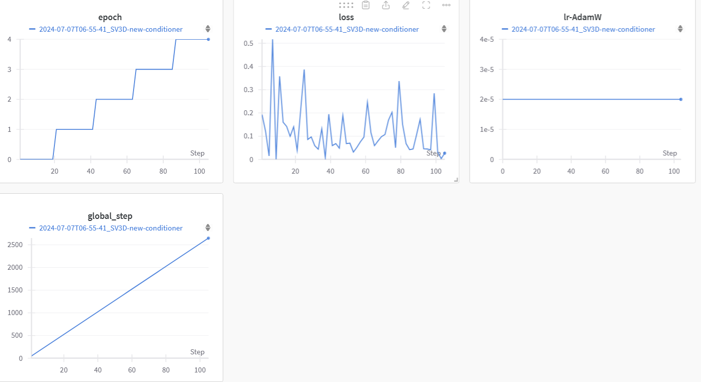

# SV3D finetuning and 1image2NV3D generation repository(WIP)

## 1. finetuning for SV3D_u or SV3D_p published by stabilityai
Example: NVIDIA A6000: 

This case is fine-tuned on the Objaverse dataset rendered by <i>blender</i> from multi-views.

I changed the parameters in the config and added another condition: **height_z**. Since the initial 3D video can only be guided and controled by the azimuth and polar in version sv3d_p and sv3d_u, w/o the radius. Hence, I added it as the height_z and change the `.yaml` files, to satisfy the conditioner config that the value of `embed_size` equals to the sum of all the `embed_key.shape[-1]`.

## 2. NV3D pipeline

Coming soon.